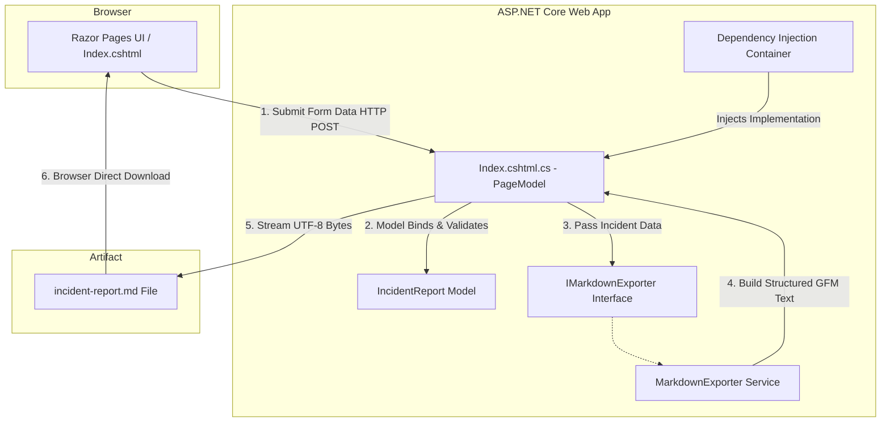

# RCALogBuilder 🛠️

A lightweight ASP.NET Core web application built with **GitHub Copilot** to streamline production incident documentation and generate standardized, GitHub-flavored Markdown post-mortems (Root Cause Analysis).

---

## Architecture Diagram



---

## Features

* **Structured RCA Capture:** Collects key metrics (downtime start, affected services, trigger, detection, containment, timeline, root cause, and prevention).
* **Instant Markdown Download:** Compiles form data directly into a downloadable `.md` file formatted with GitHub-flavored Markdown.
* **Separation of Concerns:** Uses a decoupled service layer (`IMarkdownExporter`) injected via ASP.NET Core's native DI container.
* **AI-Assisted Scaffolding:** Architecture, model bindings, service layers, and UI templates implemented directly using GitHub Copilot.

---

## Tech Stack

| Layer | Technology | Details |
| :--- | :--- | :--- |
| **Runtime & Framework** | .NET 8 / ASP.NET Core | Modern, high-performance web host |
| **Application Pattern** | Razor Pages | Clean page-based server-side routing |
| **Language** | C# 12 | Strong typing, records, and modern syntax |
| **Front-End Styling** | Bootstrap 5 | Responsive form components and layout |
| **Document Standard** | GitHub-Flavored Markdown (GFM) | UTF-8 formatted Markdown output |
| **AI Assistant** | GitHub Copilot / Copilot Edits | Prompt-driven architecture implementation |

---

## Project Structure

```text
RCALogBuilder/
│
├── Models/
│   └── IncidentReport.cs             # Core incident domain model
│
├── Services/
│   ├── IMarkdownExporter.cs          # Abstraction contract for markdown builders
│   └── MarkdownExporter.cs           # Service building GitHub-flavored Markdown
│
├── Pages/
│   ├── Shared/
│   │   ├── _Layout.cshtml            # Master application template & nav
│   │   └── _ValidationScriptsPartial.cshtml
│   ├── _ViewImports.cshtml           # Global tag helpers & namespaces
│   ├── _ViewStart.cshtml             # Global view configuration
│   ├── Error.cshtml                  # Error handler view
│   ├── Index.cshtml                  # Incident capture form UI
│   ├── Index.cshtml.cs               # PageModel handling GET and POST actions
│   └── Privacy.cshtml                # Static privacy view
│
├── Properties/
│   └── launchSettings.json           # Local dev profile & ports
│
├── wwwroot/                          # Static assets (CSS, JS, Libs)
│   ├── css/
│   └── lib/
│
├── appsettings.json                  # Application configuration settings
└── Program.cs                        # App bootstrap & DI service registration
```

---

## 🤖 GitHub Copilot Prompt Used

The complete solution components were scaffolded and wired using the following Copilot prompt:

```text
Implement the entire Incident Post-Mortem builder directly into this project workspace by creating and updating the following files:

1. Create Models/IncidentReport.cs:
   - Namespace: RCALogBuilder.Models
   - Properties: DowntimeStart, ServicesAffected, RootCause, Resolution, Timeline, Trigger, Detection, Containment, Prevention.

2. Create Services/IMarkdownExporter.cs & Services/MarkdownExporter.cs:
   - Define and implement IMarkdownExporter with method GenerateMarkdown(IncidentReport report).
   - Format output into clean GitHub-flavored Markdown (Summary, Timeline, Detection, Containment, RCA, Prevention).

3. Update Program.cs:
   - Register IMarkdownExporter with MarkdownExporter via Dependency Injection (scoped).

4. Update Pages/Index.cshtml.cs:
   - Inject IMarkdownExporter.
   - Bind IncidentReport model.
   - Implement OnPost() to generate Markdown, convert to UTF-8 bytes, and return a downloadable incident-report.md file.

5. Update Pages/Index.cshtml:
   - Create a clean Bootstrap 5 card container and form with input controls and textareas for all incident fields.
```

---

## Getting Started

### Prerequisites

* [.NET 8 SDK](https://dotnet.microsoft.com/download/dotnet/8.0)
* [Visual Studio 2022](https://visualstudio.microsoft.com/) or [VS Code with C# Dev Kit](https://code.visualstudio.com/)

### Run Locally

1. **Clone the repository:**
   ```bash
   git clone [https://github.com/Koushik92-dev/RCALogBuilder.git](https://github.com/Koushik92-dev/RCALogBuilder.git)
   cd RCALogBuilder
   ```

2. **Restore dependencies and build:**
   ```bash
   dotnet build
   ```

3. **Run the application:**
   ```bash
   dotnet run
   ```

4. Navigate to `https://localhost:5001` or `http://localhost:5000` in your web browser.

---

## Output Document Sections

The generated `.md` report adheres to standard SRE/DevOps post-mortem structures:

* **Incident Summary:** Core outage metadata, duration start, blast radius, and trigger.
* **Timeline:** Ordered log of events from detection to mitigation.
* **Detection & Containment:** How the incident was identified and initial steps taken to halt customer impact.
* **Root Cause Analysis (RCA):** Detailed technical root-cause breakdown.
* **Prevention & Action Items:** Follow-up tasks, monitoring improvements, and architectural remediations.


## Pages


---

## License

This project is licensed under the [MIT License](LICENSE).
